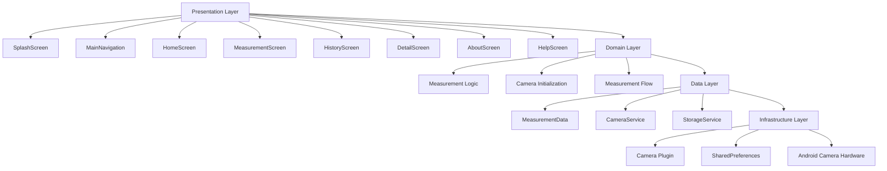
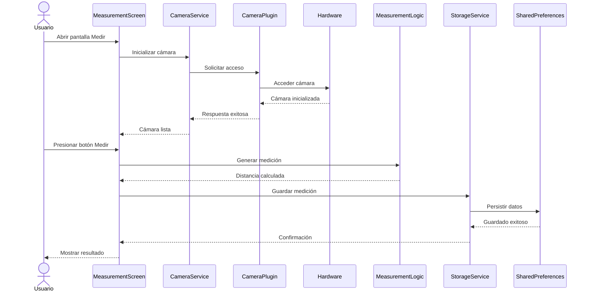
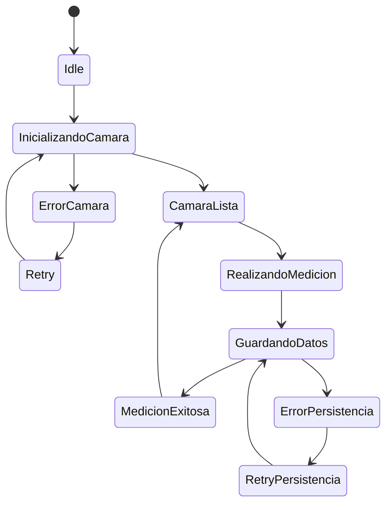

# Architecture Decision Record (ADR)

## Título

Prueba de Concepto para integración de cámara y persistencia local en Flutter.

---

# Contexto

La aplicación ARMeasure requiere validar la viabilidad técnica
de acceso a hardware móvil utilizando la cámara del dispositivo
junto con persistencia local de mediciones.

El principal riesgo identificado corresponde a la correcta
integración asíncrona entre Flutter, plugins nativos y
almacenamiento persistente.

Además, la aplicación necesita mantener las mediciones
realizadas incluso después del cierre de la aplicación.

---

# Decisión

Se decidió utilizar las siguientes tecnologías:

- camera
- shared_preferences

La librería camera fue seleccionada debido a:

- soporte oficial Flutter
- compatibilidad Android
- integración simple con widgets Flutter
- manejo asíncrono compatible con Dart

La librería shared_preferences fue seleccionada debido a:

- facilidad de implementación
- almacenamiento persistente liviano
- bajo costo computacional
- compatibilidad multiplataforma

La arquitectura fue separada en capas para desacoplar
la interfaz gráfica de la lógica de negocio y de los
servicios externos.

---

# Consecuencias

La PoC permitió validar exitosamente:

- acceso al hardware de cámara
- inicialización asíncrona de servicios
- persistencia local de mediciones
- actualización dinámica de interfaz
- manejo de estados críticos
- almacenamiento entre sesiones

Limitaciones identificadas:

- la medición actual es simulada
- dependencia de hardware físico
- persistencia limitada para grandes volúmenes de datos

Trabajo futuro:

- implementación de medición AR real
- integración de sensores avanzados
- migración a base de datos local estructurada
- implementación de arquitectura MVVM completa
- sincronización cloud

# Diagrama Estructural

---

# Diagrama de Secuencia

---

# Diagrama de Estados

