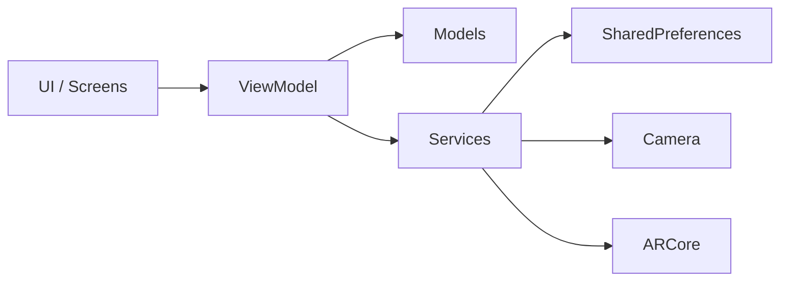
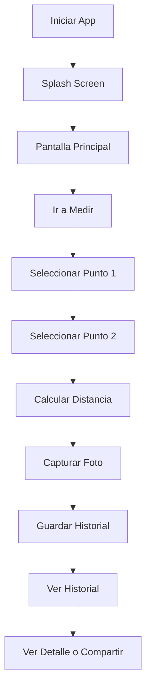

# ARMeasure

ARMeasure es una aplicación móvil desarrollada con Flutter que utiliza realidad aumentada (AR) para medir distancias entre dos puntos seleccionados por el usuario mediante la cámara del dispositivo.

La aplicación detecta superficies planas utilizando ARCore, permite seleccionar dos puntos sobre ellas y calcula la distancia entre ambos en tiempo real. Además, incorpora captura de fotografías, almacenamiento local del historial de mediciones, configuración de preferencias de visualización y herramientas de interoperabilidad con Android para compartir resultados y enviar encuestas de validación.

---

# Descripción General del Proyecto

Este proyecto fue desarrollado en el contexto de **Digital Workspace Mobility – LIRCAYHUB**, con el objetivo de evolucionar una maqueta funcional hacia un prototipo funcional integrando:

* Arquitectura MVVM
* Servicios móviles / hardware
* Persistencia de datos
* Validación con usuarios reales
* Identidad digital del producto

---

# Historias de Usuario

* Como usuario, quiero medir la distancia entre dos puntos usando la cámara para evitar usar herramientas físicas.
* Como usuario, quiero guardar mis mediciones para revisarlas después.
* Como usuario, quiero asociar una fotografía a cada medición.
* Como usuario, quiero configurar la forma en que se muestran las mediciones.
* Como usuario, quiero compartir resultados fácilmente.

---

# Requerimientos Funcionales

* RF1: Detectar superficies planas mediante realidad aumentada.
* RF2: Permitir seleccionar dos puntos en pantalla.
* RF3: Calcular la distancia entre los puntos seleccionados.
* RF4: Mostrar resultados en distintas unidades (m, cm, in, ft).
* RF5: Permitir reiniciar la medición.
* RF6: Capturar una fotografía después de medir.
* RF7: Guardar mediciones en un historial local.
* RF8: Mostrar el detalle de cada medición.
* RF9: Compartir mediciones con imagen.
* RF10: Configurar cantidad de decimales.
* RF11: Realizar una encuesta de valoración.

---

# Requerimientos No Funcionales

* RNF1: Interfaz simple e intuitiva.
* RNF2: Tiempo de respuesta corto.
* RNF3: Persistencia local de datos.
* RNF4: Compatibilidad con dispositivos Android con soporte ARCore.

---

# Arquitectura del Proyecto

La aplicación utiliza una arquitectura modular basada en features, separando responsabilidades para facilitar mantenimiento y escalabilidad.

## Estructura

```text
lib/
│
├── core/
│   ├── data/
│   ├── services/
│   ├── theme/
│   └── utils/
│
├── features/
│   ├── splash/
│   ├── navigation/
│   ├── home/
│   ├── measurement/
│   ├── history/
│   ├── preferences/
│   └── survey/
```

Esto permite:

* Mejor mantenimiento
* Escalabilidad
* Separación de responsabilidades
* Reutilización de componentes

---

# Diagrama Arquitectónico



---

# Servicios Móviles Integrados

## Cámara

Utilizada para:

* Visualizar el entorno
* Capturar fotografías de mediciones

## Realidad Aumentada

Usando ARCore para:

* Detección de superficies
* Posicionamiento espacial
* Medición 3D

ARCore utiliza:

* Cámara
* Giroscopio
* Acelerómetro
* Sensores de movimiento

## Intents Android

Interoperabilidad con el sistema mediante:

* Compartir mediciones
* Enviar resultados por correo

---

# Persistencia de Datos

La aplicación utiliza `shared_preferences` para almacenamiento local.

Datos persistidos:

## Historial

Cada medición guarda:

* Distancia
* Ruta de imagen

## Preferencias

Configuraciones:

* Unidad de medida
* Cantidad de decimales

---

# Flujo de Uso



---

# Prueba de Concepto (PoC) y ADR

## Riesgo Técnico

Determinar si era posible medir distancias usando realidad aumentada con precisión aceptable.

## Solución Adoptada

Integración de ARCore mediante Flutter.

## Resultado

La PoC confirmó que:

* La detección de superficies funciona
* La selección de puntos es estable
* La medición espacial es viable

Cálculo:

distance = √((x2-x1)² + (y2-y1)² + (z2-z1)²)

---

# QA / Beta Testing

Se realizó validación funcional con usuarios reales.

## Participantes

* 2 usuarios externos a la industria
* 2 conocedores de la industria
* 9 participantes de Digital Workspace Mobility

Total evaluaciones:
**13 usuarios**

---

## Instrumento de Evaluación

Encuesta JSON de 6 preguntas evaluadas en escala 1–5:

* Facilidad de uso
* Claridad de interfaz
* Satisfacción con la medición
* Velocidad de respuesta
* Precisión de resultados
* Recomendación

---

## Resultados

| Métrica                | Externos | Expertos |      DWM |
| ---------------------- | -------: | -------: | -------: |
| Facilidad de uso       | **4.50** | **3.50** | **3.89** |
| Claridad interfaz      | **3.50** | **3.00** | **4.44** |
| Medición satisfactoria | **4.50** | **3.00** | **4.22** |
| Velocidad              | **2.00** | **4.00** | **3.78** |
| Precisión              | **4.00** | **4.00** | **4.00** |
| Recomendación          | **4.50** | **3.50** | **3.78** |


## Análisis Ejecutivo

### Aspectos positivos

* La interfaz fue considerada clara e intuitiva.
* La funcionalidad principal de medición fue bien evaluada.
* La precisión fue satisfactoria en la mayoría de pruebas.

### Aspectos a mejorar

* Algunos usuarios percibieron lentitud.
* La calibración AR inicial puede tardar.
* La captura de foto posterior a la medición puede optimizarse.

---

# Technical Debt / Trabajos Futuros

* Mejorar rendimiento general
* Optimizar inicialización de ARCore
* Reducir tiempo de calibración
* Implementar base de datos más robusta
* Mejorar arquitectura MVVM con gestor de estado formal
* Incorporar sincronización en la nube

---

# Identidad Digital

## Package Name

Identificador personalizado del proyecto.

Ejemplo:
`com.lircayhub.armeasure`

## Paleta de Colores

Colores principales:

* Amarillo
* Negro
* Blanco
* Gris

## App Icon

La aplicación incluye ícono personalizado y splash screen.

---

# Instrucciones de Uso

1. Abrir la aplicación
2. Ir a la sección Medir
3. Apuntar a una superficie plana
4. Esperar detección del plano
5. Seleccionar dos puntos
6. Presionar Medir
7. Capturar fotografía
8. Revisar historial o compartir

---

# APK

Se incluye APK para Android.

Ruta:
`build/app/outputs/flutter-apk/app-debug.apk`

## Instalación

1. Descargar APK
2. Transferir al dispositivo
3. Habilitar orígenes desconocidos
4. Instalar
5. Conceder permisos de cámara

---

# Recursos Multimedia

Video demostrativo:
[Agregar link]

Video exposición técnica:
[Agregar link]

---

# Repositorio

https://github.com/Poketeam8/ARMeasure
