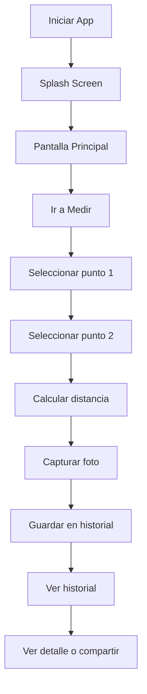

# ARMeasure

ARMeasure es una aplicación móvil desarrollada en Flutter que utiliza realidad aumentada (AR) para medir distancias entre dos puntos seleccionados por el usuario usando la cámara del dispositivo.

La aplicación permite detectar superficies planas, seleccionar dos puntos sobre ellas y calcular la distancia entre ambos. Además, permite capturar una fotografía asociada a cada medición, guardar un historial local, compartir resultados y configurar preferencias de visualización como unidad de medida y cantidad de decimales.

Para su funcionamiento, la aplicación utiliza distintas capacidades del dispositivo: la cámara para capturar el entorno y tomar fotografías, sensores como giroscopio y acelerómetro para el posicionamiento espacial, ARCore para detección de planos y cálculo espacial, pantalla táctil para seleccionar puntos y almacenamiento local para guardar las mediciones.

## Historias de Usuario

* Como usuario, quiero medir la distancia entre dos puntos usando la cámara para evitar usar herramientas físicas.
* Como usuario, quiero guardar mis mediciones para revisarlas después.
* Como usuario, quiero asociar una fotografía a cada medición.
* Como usuario, quiero configurar la forma en que se muestran las mediciones.
* Como usuario, quiero compartir resultados fácilmente.

## Requerimientos Funcionales

* RF1: Detectar superficies planas mediante realidad aumentada.
* RF2: Permitir seleccionar dos puntos en pantalla.
* RF3: Calcular la distancia entre los puntos seleccionados.
* RF4: Mostrar resultados en distintas unidades (m, cm, in, ft).
* RF5: Permitir reiniciar la medición.
* RF6: Capturar una fotografía después de medir.
* RF7: Guardar mediciones en un historial local.
* RF8: Mostrar el detalle de cada medición.
* RF9: Compartir mediciones con imagen.
* RF10: Configurar cantidad de decimales.
* RF11: Realizar una encuesta de valoración.

## Requerimientos No Funcionales

* RNF1: Interfaz simple e intuitiva.
* RNF2: Tiempo de respuesta corto.
* RNF3: Persistencia local de datos.
* RNF4: Compatibilidad con dispositivos Android que soporten ARCore.

El proyecto se estructura utilizando una arquitectura modular basada en features, separando responsabilidades para facilitar el mantenimiento y escalabilidad. La navegación principal se implementa mediante BottomNavigationBar y la navegación secundaria mediante Navigator. También se utiliza el patrón lista-detalle en la sección de historial.

## Instrucciones de uso

1. Abrir la aplicación.
2. Ir a la sección de medición.
3. Apuntar la cámara hacia una superficie.
4. Seleccionar dos puntos.
5. Presionar el botón de medición.
6. Capturar una fotografía.
7. Revisar o compartir el resultado desde el historial.

Repositorio del proyecto: https://github.com/Poketeam8/ARMeasure

## Descarga del APK

Se incluye un archivo **apk-debug** en el repositorio para probar la aplicación en dispositivos Android.

### Instalación

1. Descargar el archivo `app-debug.apk` desde el repositorio.
   Ruta del archivo dentro del proyecto:build/app/outputs/flutter-apk/app-debug.apk
2. Transferirlo al dispositivo Android si fue descargado desde un PC.
3. Habilitar la opción **Instalar aplicaciones de orígenes desconocidos** si el sistema lo solicita.
4. Abrir el archivo APK e instalar la aplicación.
5. Conceder permisos de cámara cuando la aplicación lo solicite.
