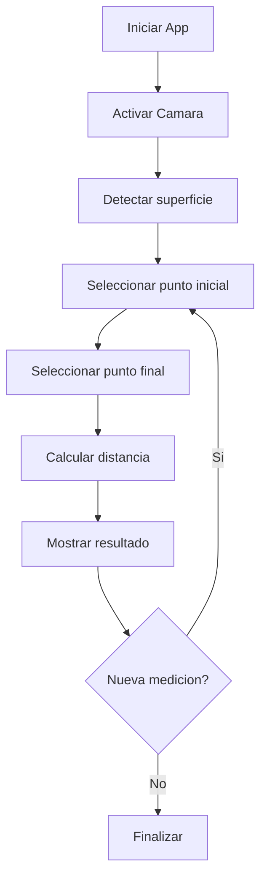

Aplicación móvil desarrollada en Flutter que utiliza realidad aumentada (AR) para medir distancias, objetos y superficies en el mundo real a través de la cámara del dispositivo. Actualmente, medir objetos o espacios requiere herramientas físicas como reglas o cintas métricas, las cuales no siempre están disponibles. Como solución, la aplicación permite al usuario apuntar con su teléfono a un objeto o espacio y obtener medidas aproximadas sin necesidad de herramientas externas.

La aplicación utiliza distintas capacidades del dispositivo: cámara para capturar el entorno en tiempo real, sensores (giroscopio y acelerómetro) para el posicionamiento espacial, procesamiento de realidad aumentada para la detección de planos, pantalla táctil para seleccionar puntos de medición y almacenamiento para guardar mediciones realizadas.

Historias de Usuario
Como usuario, quiero medir la distancia entre dos puntos usando la cámara para evitar utilizar una regla física.
Como usuario, quiero visualizar las medidas en pantalla en tiempo real para obtener resultados inmediatos.
Como usuario, quiero guardar mediciones para consultarlas después sin necesidad de registrarlas manualmente.
Como usuario, quiero una interfaz simple para medir rápidamente sin complejidad innecesaria.

Requerimientos Funcionales
RF1: Detectar superficies planas mediante realidad aumentada.
RF2: Permitir seleccionar puntos en pantalla.
RF3: Calcular la distancia entre puntos seleccionados.
RF4: Mostrar resultados en unidades métricas (cm, m).
RF5: Permitir reiniciar la medición.

Requerimientos No Funcionales
RNF1: Interfaz intuitiva y fácil de usar.
RNF2: Tiempo de respuesta corto.
RNF3: Precisión aceptable.
RNF4: Compatible con dispositivos que soporten ARCore.

El proyecto se estructura utilizando una arquitectura modular basada en features, separando responsabilidades para facilitar el mantenimiento y la escalabilidad. La navegación se implementa mediante un BottomNavigationBar para acceder a las secciones principales de la aplicación y navegación por pila (Navigator.push y pop) para acceder a vistas de detalle. Además, se utiliza el patrón lista-detalle para mostrar un conjunto de mediciones y acceder a la información específica de cada una.

Instrucciones de uso

Abrir la aplicación en el dispositivo móvil.
Acceder a la sección de medición desde la navegación principal.
Apuntar la cámara hacia una superficie plana.
Tocar la pantalla para seleccionar el punto inicial.
Tocar nuevamente para seleccionar el punto final.
La aplicación mostrará la distancia entre los puntos seleccionados.
Repetir el proceso para nuevas mediciones.

Repositorio del proyecto: https://github.com/Poketeam8/ARMeasure
Video de exposición: https://drive.google.com/file/d/1Vk8wg7AybH0QN0okeNGty2-0dDyYdBaI/view?usp=sharing